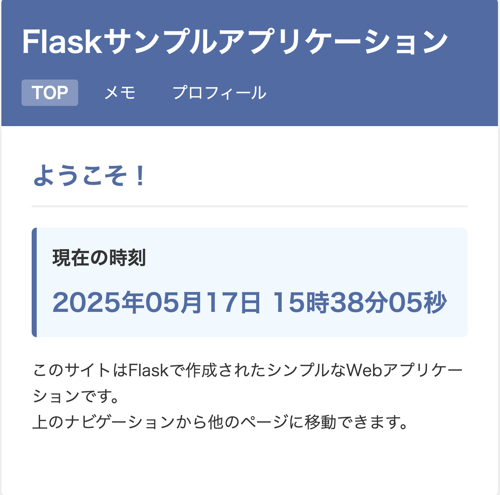
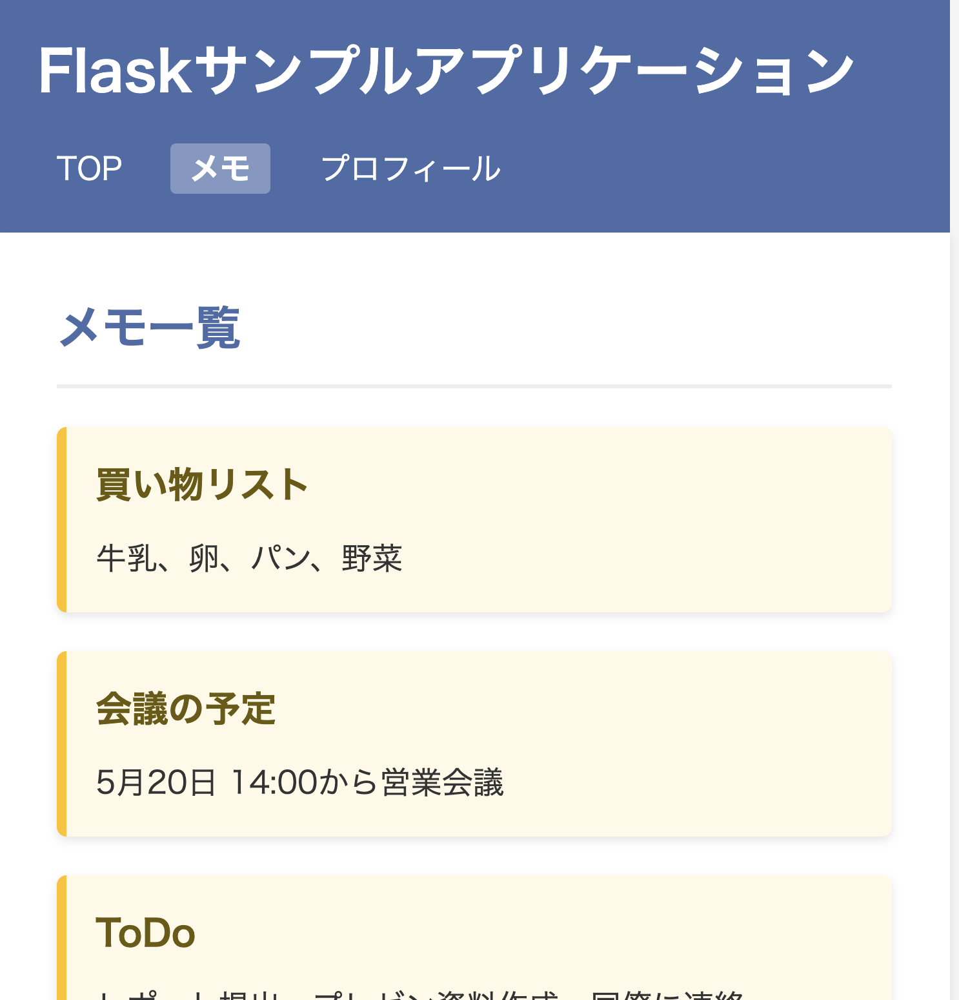
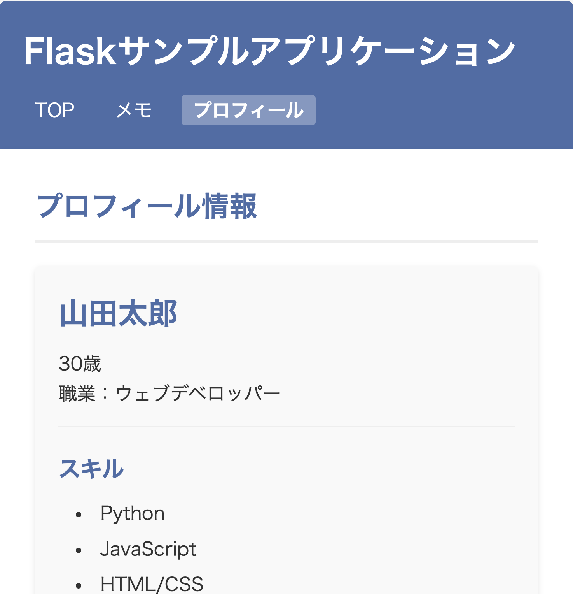
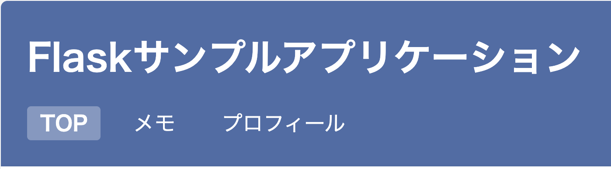

<!-- _class: lead -->
# ウェブページを行き来できるアプリを作ってみよう！
## Flaskで作る簡単なウェブアプリ

---

# ウェブアプリって何？

- インターネット上で動くプログラムのこと
- スマホやパソコンのブラウザで見ることができる
- 今回は **Python** という言語と **Flask** という道具で作る
- **ブラウザ**（ChromeやSafari）で見るよ！


---

# このアプリでできること

- 3つのページを自由に行き来できる！
- それぞれのページでできることが違う
- ページの上にあるメニューからどこへでも移動できる

---

# トップページ



- 今の日本時間がわかる
- 「時・分・秒」まで正確に表示
- ようこそメッセージで訪問者を歓迎
- きれいな青色のデザイン

---

# メモページ



- 大切なメモを見ることができる
- 買い物リストや予定を確認
- やることリストも表示
- 黄色いカードでわかりやすく表示

---

# プロフィールページ



- 自分の情報を見ることができる
- 名前や年齢、職業がわかる
- 得意なことや好きなことをリストで表示
- すっきりとした見やすいデザイン

---

# ページの切り替え方

- 上のナビゲーションメニューをクリックするだけ！
- リンクをクリックすると、サーバーに「そのページを見せて」とお願いする
- サーバーはそのリクエストを受け取り、適切なページを返してくれる
- 今見ているページは色が変わって強調表示される



---

# プログラムの見どころ：Flaskのルーティング

```python
@app.route('/')
def top():
    # 日本時間を取得
    japan_tz = pytz.timezone('Asia/Tokyo')
    current_time = datetime.now(japan_tz).strftime('%Y年%m月%d日 %H時%M分%S秒')
    return render_template('top.html', current_time=current_time)
```

- `@app.route('/')`：トップページの住所（URL）を決める
- ブラウザがこの住所にアクセスしたら、下の関数を実行する
- `current_time`：今の時間を計算して、ページに渡す

---

# プログラムの見どころ：テンプレート

```html
<div class="time-box">
    <h3>現在の時刻</h3>
    <p class="current-time">{{ current_time }}</p>
</div>
```

- HTMLというマークアップ言語でページのデザインを作る
- `{{ current_time }}`：Pythonから受け取った時間を表示する場所
- `class="time-box"`：CSSでデザインするための目印

---

# 作り方のポイント

- **HTML**：ページの内容やボタン、テキストを作る
- **CSS**：ページの色や大きさ、配置などをきれいに整える
- **Python**：「ページを表示する」「時間を計算する」などの動きをつける
- **Flask**：PythonでWebアプリを簡単に作るための道具

---

# HTMLとCSSの例

```html
<div class="profile-header">
    <h3>{{ profile.name }}</h3>
    <p>{{ profile.age }}歳</p>
    <p>職業：{{ profile.occupation }}</p>
</div>
```

```css
.profile-header {
    margin-bottom: 20px;
    padding-bottom: 15px;
    border-bottom: 1px solid #eee;
}
```

---

# 自分でチャレンジ！

1. **新しいページを追加してみよう**
   - 「好きな食べ物」ページを作ってみる？

2. **デザインを変えてみよう**
   - 色やフォント、配置を自分好みに変更

3. **情報を追加してみよう**
   - メモをもっと増やしたり、プロフィールに新しい項目を追加


---

<!-- _class: lead -->
# まとめ

- ウェブアプリの基本が学べた
- 複数ページの連携方法がわかった
- HTMLとCSSでデザインする方法を知った
- Pythonとflaskで動きをつける方法を学んだ

**これからもっと色々なウェブアプリが作れるようになるよ！** 